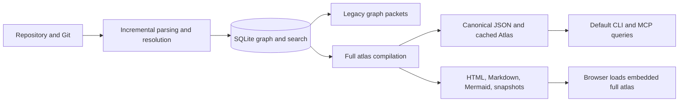

# CodeAtlas product and implementation audit

Audit date: 5 September 2026. Version: 0.10.0. Source revision: `9517fc428e7e2d1d0013f2a663f0354fb792a3d5`.

**Recommendation: make CodeAtlas the evidence layer for understanding and changing an unfamiliar system.** Its strongest opportunity is to deliver the same task-specific understanding to a developer and a coding agent: where to start, how a change travels through the system, what to test, and what is still unknown.

The indexing foundation is substantial. Product readiness is uneven: ordinary control-flow cases are incorrect, the default MCP path has ambiguity and contract gaps, and existing evaluations do not establish improved agent outcomes. Address these before expanding the feature list or making stronger accuracy claims.

The companion [implementation roadmap](codeatlas-ai-era-implementation-plan.md) translates this audit into deliverables, dependencies, acceptance criteria, and a focused 90-day sequence. [Probe evidence](codeatlas-ai-era-audit-evidence.json) records the synthetic reproductions and local measurements.

## Scope and evidence

This audit combined source inspection, the project check command, compiled CLI execution, real MCP stdio calls, synthetic semantic probes, a fresh local clone of CodeAtlas, and browser inspection of its generated architecture viewer. The working tree was clean at the start. Production implementation was not changed.

| Check | Observation |
|---|---|
| `npm run check` | Type checking, linting, and 153 tests across 36 test files passed |
| `npm run package:smoke` | Passed: packed 499 files, installed the tarball, and exercised version/init/status/overview/ask/setup in a disposable consumer |
| Runtime | Windows, Node 24.12.0, npm 10.5.2 |
| Self-analysis | Fresh local clone, without installing the clone's dependencies; used the available fallback analysis environment |
| Self-build | 19.70 seconds reported by the build; 242 files, 6,777 symbols, 24,485 relationships, 22 domains, 4 entrypoints, 300 CFGs |
| Self-export | HTML: 16,579,985 bytes, about 15.81 MiB; canonical JSON: 63,649,572 bytes, about 60.70 MiB |
| Default MCP discovery | 19 tools; serialized discovery response 7,661 bytes; none advertised output schemas or annotations |
| Self MCP overview | One measured call: 566 ms |
| Self MCP search | Three measured calls: 1,294 / 1,270 / 1,282 ms, returning at most ten results |
| Browser | Overview and entrypoint navigation worked; architecture view visually inspected |
| Existing release evidence | 12 independent repository records are checked in; these were inspected, not rerun on all platforms |

These are small local observations, not p95 benchmarks or comparisons with competitors. The README's large-repository benchmark measures raw graph packets separately from freshness and explicitly excludes MCP transport. Its numbers are not directly comparable to the canonical MCP measurements above. Actual hosted-model task success, token savings, retention, and competitor performance were not measured during this audit.

## What is worth preserving

- **Local, incremental analysis:** content hashes, Git-aware invalidation, SQLite storage, transactional generations, and freshness checks are a useful foundation for an actively edited repository.
- **Evidence as a product concept:** stable identifiers, source locations, confidence, ambiguity records, and definite versus potential impact are more valuable than an attractive graph alone.
- **Existing workflow coverage:** CLI/MCP, static HTML, Mermaid/SVG, snapshots, architecture rules, and Git/base-head review already exist. They should be improved and connected rather than rebuilt independently.
- **Extensibility:** language and framework registration APIs are already public. Adapter work can build on those boundaries.
- **Engineering discipline:** parser fixtures, compiled CLI and MCP tests, cross-platform workflows, coverage thresholds, package smoke tests, dependency auditing, pinned actions, and release evidence provide real protection. Passing them does not establish semantic completeness.

The older product implementation plan correctly identified a shared query service and bounded delivery. A shared `ArchitectureService` now exists, as do several other planned features. However, it still materializes a full atlas, and `--bundle` does not provide a lazily loaded viewer. Treat the old plan as historical context and reconcile its status with the implementation.

The current delivery architecture explains several findings:

Freshness and cache reuse exist around these paths. The next architectural step is to make bounded canonical queries independent of full snapshot/export work while preserving identical facts across interfaces.

## Findings

Priority **P1** means address in the next reliability cycle. **P2** means a material product or scale limitation. Findings marked “reproduced” were exercised; other findings are source observations or product judgments.

### F1 — P1: the control-flow graph is wrong for common code

**Reproduced.** For `return calculate()`, the generated graph connects `START → RETURN → END`. It also creates a `calculate()` call node, but that node is disconnected from the reachable execution path. For `if (flag) { left(); } else { right(); } done();`, the true branch can execute both `left()` and `right()`, while the false branch skips directly to `done()`. A return inside `try/finally` bypasses cleanup in the generated reachable path.

The implementation collects interesting syntax nodes, sorts them by source offset, and connects them with special cases. Source order is not execution order. These diagrams can teach an incorrect mental model and give agents false evidence about a proposed change.

**Implementation direction:** lower syntax into explicit basic blocks with expression evaluation, branch joins, abrupt completions, and finally handling. Stop traversal at nested function boundaries. Until constructs are implemented, return a clearly identified approximation or an unsupported diagnostic. Do not label that result an exact CFG.

**Acceptance:** path-level assertions for return expressions, if/else exclusivity, loops, short-circuit expressions, nested functions, break/continue, exceptions, and finally. Test outcomes and reachability, not just the presence of node kinds or branch labels.

Source: [control-flow construction](https://github.com/Dinesh-Das/CodeAtlas/blob/9517fc428e7e2d1d0013f2a663f0354fb792a3d5/src/analysis/control-flow.ts#L41).

### F2 — P1: a duplicate qualified name can silently select the wrong symbol

**Reproduced over MCP.** `find_symbol("login")` returned functions in both `src/app.ts` and `src/auth/controller.ts`, each with `qualified_name: "login"`. `get_symbol({target:"login"})` selected the first without reporting ambiguity.

The shared canonical resolver uses `.find()` for either an exact ID or an exact qualified name. Only its later substring path checks uniqueness. This affects every tool that uses that resolver, including impact and evidence queries.

**Implementation direction:** resolve IDs separately; collect all qualified-name matches; require uniqueness or return candidates with file, package, kind, and signature. Preserve existing stable IDs while adding an unambiguous display locator such as `package:file#qualifiedName`.

**Acceptance:** duplicates across files, workspaces, and overloads produce explicit ambiguity. Passing an exact returned ID succeeds deterministically.

Source: [canonical resolver](https://github.com/Dinesh-Das/CodeAtlas/blob/9517fc428e7e2d1d0013f2a663f0354fb792a3d5/src/mcp/ir-tools.ts#L124).

### F3 — P1: CFG evidence and the grounding validator disagree about hashes

**Reproduced.** The grounding validator rejected the two statement evidence records for the simple return example and five each for the branch and cleanup examples. The reason was “evidence content hash does not match its symbol.” The enclosing symbol evidence was accepted.

CFG evidence hashes the statement slice, while validation compares that hash with the enclosing symbol's hash. Both can be legitimate hashes of different content. Meanwhile, `get_evidence` returns evidence directly without invoking that grounding validator, so a record can be displayed through one surface and rejected through another.

**Implementation direction:** distinguish `file_content_hash`, `symbol_content_hash`, and `range_content_hash`, and specify the bytes and coordinate convention each identifies. Apply one evidence-validation contract to MCP, answers, review, and exports. Report excerpt truncation separately from the full evidence range.

**Acceptance:** valid statement evidence passes all surfaces; stale, edited, moved, and mismatched evidence is rejected consistently. A citation's existence must not be treated as proof that an arbitrary sentence is true.

Sources: [CFG evidence](https://github.com/Dinesh-Das/CodeAtlas/blob/9517fc428e7e2d1d0013f2a663f0354fb792a3d5/src/analysis/control-flow.ts#L105), [hash comparison](https://github.com/Dinesh-Das/CodeAtlas/blob/9517fc428e7e2d1d0013f2a663f0354fb792a3d5/src/ir/evidence-validation.ts#L42), [MCP evidence lookup](https://github.com/Dinesh-Das/CodeAtlas/blob/9517fc428e7e2d1d0013f2a663f0354fb792a3d5/src/mcp/ir-tools.ts#L299).

### F4 — P1: the default MCP surface does not preserve the documented packet contract

**Protocol and source observation.** The default server exposes 19 canonical tools. The ten typed legacy tools are behind `CODEATLAS_MCP_LEGACY_TOOLS=1`. The canonical tools provide structured results but do not advertise output schemas or tool annotations. `irResult()` adds generic next actions and a byte guard; it does not consistently add snapshot/freshness metadata, content-trust labels, coverage, or uncertainty diagnostics.

The IR's top-level fact classes are `EXTRACTED`, `RESOLVED`, and `INFERRED`. Its loader does not carry the database's selected `provenance_category` into a corresponding first-class IR field. Some uncertainty survives in confidence and metadata, but consumers cannot rely on the clear verified/inferred/dynamic/unresolved contract presented in the README. Unresolved-reference records are also not a first-class atlas collection.

**Implementation direction:** introduce a versioned response envelope shared by all canonical tools. Preserve relation semantics, conditionality, resolution status, source trust, coverage limits, and generation identity explicitly. Annotate user-code read-only tools accurately while documenting that freshness can update local caches; annotations are hints, not a security boundary. Add output schemas and structured, recoverable errors.

**Acceptance:** every canonical response validates against its advertised schema, labels source-derived content untrusted, and exposes the snapshot and analysis limitations relevant to that query. Add protocol tests against the default profile, not only legacy packets. MCP supports structured tool contracts; use that capability deliberately. [MCP tools specification](https://modelcontextprotocol.io/specification/2025-11-25/server/tools).

Sources: [tool registration](https://github.com/Dinesh-Das/CodeAtlas/blob/9517fc428e7e2d1d0013f2a663f0354fb792a3d5/src/mcp/server.ts#L82), [response wrapper](https://github.com/Dinesh-Das/CodeAtlas/blob/9517fc428e7e2d1d0013f2a663f0354fb792a3d5/src/mcp/ir-tools.ts#L444), [IR conversion](https://github.com/Dinesh-Das/CodeAtlas/blob/9517fc428e7e2d1d0013f2a663f0354fb792a3d5/src/ir/loader.ts#L190).

### F5 — P2: bounding results does not bound query work or model context

**Measured and source observation.** Canonical search scans and ranks every symbol. Its search text repeatedly looks up evidence using `.find()` across the evidence array. This can approach symbols × evidence work even for a ten-result query. The FTS/BM25 infrastructure already exists elsewhere but is not the default canonical search path.

Three searches on the 6,777-symbol self-index took about 1.27–1.29 seconds each. This does not establish large-repository performance, but it is enough to justify profiling the canonical path. The one-million-byte page limit and two-million-byte response limit are safety ceilings, not useful agent token budgets. Responses can include extensive nested memberships or repeated evidence before hitting those ceilings.

**Implementation direction:** use indexed candidate retrieval, precomputed lookups, adjacency queries, deduplicated source ranges, and task-specific ranking. Accept token budgets with tokenizer identity or an explicitly labeled estimate. Return omissions, coverage, and resumable continuation rather than a generic oversized-response error.

**Acceptance:** benchmark end-to-end canonical calls, including freshness and serialization, across cold/warm/changed states. Measure model-visible input tokens separately from wire bytes; the MCP text and structured representation do not imply every host feeds both to the model.

Sources: [search scan](https://github.com/Dinesh-Das/CodeAtlas/blob/9517fc428e7e2d1d0013f2a663f0354fb792a3d5/src/mcp/ir-tools.ts#L139), [evidence lookup during ranking](https://github.com/Dinesh-Das/CodeAtlas/blob/9517fc428e7e2d1d0013f2a663f0354fb792a3d5/src/analysis/simplification.ts#L217), [existing FTS](https://github.com/Dinesh-Das/CodeAtlas/blob/9517fc428e7e2d1d0013f2a663f0354fb792a3d5/src/storage/search.ts#L11).

### F6 — P2: bundle mode still requires loading the entire atlas

**Reproduced and source observation.** The small fixture's bundle HTML embedded all 63 symbols present in its atlas. The bundle writes shards but uses the same `renderAtlasHtml()` as single-file export. Startup decompresses the entire atlas and constructs maps for all symbols, relationships, and evidence. The browser does not consume those shards on demand.

Similarly, `ArchitectureService` loads and validates the entire canonical JSON and rebuilds exports through `buildRepository()` when reuse fails. Every canonical tool asks for architecture freshness, even when the requested data could use a narrower generation. Cache reuse is real; bounded database-backed projections are still needed.

The self-export was 15.81 MiB of HTML backed by 60.70 MiB of JSON. Gzip reduces transfer size; it does not remove decompression, parse, or in-memory graph costs. The existing bounded drawing surface is useful and should be retained.

**Implementation direction:** separate indexing, querying, and exporting. Serve bounded projections from SQLite in local live mode; give bundle mode an actual manifest-driven loader. Keep single-file export as an explicit portable snapshot with a size estimate. Do not make canonical query correctness depend on HTML export succeeding.

Sources: [HTML startup](https://github.com/Dinesh-Das/CodeAtlas/blob/9517fc428e7e2d1d0013f2a663f0354fb792a3d5/src/export/html.ts#L17), [bundle writer](https://github.com/Dinesh-Das/CodeAtlas/blob/9517fc428e7e2d1d0013f2a663f0354fb792a3d5/src/export/json.ts#L51), [build/export coupling](https://github.com/Dinesh-Das/CodeAtlas/blob/9517fc428e7e2d1d0013f2a663f0354fb792a3d5/src/compiler/build.ts#L484), [shared service](https://github.com/Dinesh-Das/CodeAtlas/blob/9517fc428e7e2d1d0013f2a663f0354fb792a3d5/src/service/architecture-service.ts#L124).

### F7 — P1 for launch claims: current evaluation does not prove agent usefulness

**Reproduced and source observation.** Asking “Why did the team choose this architecture?” returned regions and entrypoints without explaining a decision. The architecture-quality evaluator nevertheless scored it 1.0. That evaluator is designed around overview form, so this example demonstrates its limited scope, not a failure to satisfy its implemented rubric.

The release validator's `agentQuestion` calls `answerFromAtlas()` and checks this same rubric. No LLM executes a coding task. The answer generator also contains a special case naming CodeAtlas's own MCP implementation functions. The checked-in independent-repository records establish useful build and smoke coverage, but not independent answer correctness, relationship precision, or agent improvement. A “verified relationship percentage” measures the analyzer's classifications, not correctness against ground truth.

**Implementation direction:** keep these checks as smoke tests and name them accordingly. Add held-out questions and changes, human-reviewed expected evidence, test-verified patch outcomes, and repeated agent runs. Separate retrieval recall, graph precision, answer support, task success, latency, and cost.

**Acceptance:** publish paired baseline versus CodeAtlas results with identical repositories, commits, model versions, prompts, environments, and task budgets. Include failures, uncertainty, and task-level confidence intervals. Do not tune against the held-out set. These practices align with task-oriented tool evaluations described by Anthropic. [Tool evaluation guidance](https://www.anthropic.com/engineering/writing-tools-for-agents).

Sources: [answer special case](https://github.com/Dinesh-Das/CodeAtlas/blob/9517fc428e7e2d1d0013f2a663f0354fb792a3d5/src/ai/answering.ts#L182), [quality rubric](https://github.com/Dinesh-Das/CodeAtlas/blob/9517fc428e7e2d1d0013f2a663f0354fb792a3d5/src/ai/answering.ts#L308), [release probe](https://github.com/Dinesh-Das/CodeAtlas/blob/9517fc428e7e2d1d0013f2a663f0354fb792a3d5/scripts/validate-release-repository.mjs#L104).

### F8 — P2: portable artifacts need an explicit sharing policy

**Reproduced.** A deliberately fake credential assigned inside a normal TypeScript function appeared in canonical JSON and the decompressed HTML payload. This is expected from the excerpt reader, which copies bounded source text without secret-value filtering. Signature redaction and secret-file ignores do not protect ordinary source excerpts, CFG labels, or Git diffs.

This audit found no outbound upload. `SECURITY.md` already tells users to protect artifacts like source and review before publication. The issue is an important limit on a proposed public sharing/growth workflow, not evidence of silent exfiltration.

**Implementation direction:** provide explicit internal and shareable export policies, with a source-free default for public demos, exclusions, detected-secret redaction, and an export manifest stating what is included. Apply policy consistently to HTML, JSON/JSONL, Markdown, Mermaid/SVG, snapshots, source diffs, and agent packets. Offer preview before any future publishing action. Detection can reduce risk but cannot guarantee all secrets are recognized.

**Acceptance:** synthetic canaries in snippets, comments, labels, signatures, and diffs do not appear under the shareable policy. Internal source-rich output remains clearly identified. Public export must also consider sensitive paths, domain names, and infrastructure metadata.

Sources: [excerpt reader](https://github.com/Dinesh-Das/CodeAtlas/blob/9517fc428e7e2d1d0013f2a663f0354fb792a3d5/src/ir/evidence.ts#L30), [existing security policy](https://github.com/Dinesh-Das/CodeAtlas/blob/9517fc428e7e2d1d0013f2a663f0354fb792a3d5/SECURITY.md#L21).

### F9 — P2: the developer experience exposes the graph before teaching the system

**Browser observation and product judgment.** The self-report begins with counts and 22 architecture regions. At the inspected desktop width, the diagram required horizontal scrolling, while an empty details panel occupied substantial space. Names such as `Cli`, `Ir`, and `Src` describe code organization but do not explain responsibilities, design decisions, or a user's journey. Entrypoint navigation works, but presents function names rather than a guided learning path.

The Markdown overview similarly lists counts, regions, entrypoints, impact scores, and rules. `ask` is deterministic retrieval and template composition; it does not currently provide a general explanation of design rationale. A request about where to add login rate limiting produced relevant connections but no concrete placement guidance or test plan.

**Implementation direction:** add a “Start here” tour with purpose, boundaries, key flows, local setup, relevant tests, decisions, pitfalls, and a first safe change. Attach each statement to code, documentation, configuration, or a maintainer annotation, and retain that distinction. Put a small responsibility diagram above counts. Support “Copy context for this task” from a selected flow or component.

**Acceptance:** unfamiliar developers complete a defined navigation/change exercise using the tour; measure time, correctness, and unanswered questions. A visually impressive graph alone is not the success criterion.

Source: [current Markdown product](https://github.com/Dinesh-Das/CodeAtlas/blob/9517fc428e7e2d1d0013f2a663f0354fb792a3d5/src/export/markdown.ts#L5).

### F10 — P2: system architecture requires evidence beyond symbol dependencies

**Source observation and product judgment.** The current adapters cover Express, Fastify, FastAPI, Prisma, and SQLAlchemy. They can expose useful route/data relationships. They do not establish a complete deployed system with actors, services, queues, external APIs, deployment boundaries, and cross-repository contracts. Domain communities and package dependencies should not automatically be presented as services or deployment containers.

**Implementation direction:** add explicit system entities and contracts from Compose, OpenAPI, package/workspace manifests, selected infrastructure configuration, and maintainer overrides. Then support request/data/event journeys between these boundaries. C4 provides a useful vocabulary for system context, containers, components, and code; these are different abstraction levels. [C4 diagram guidance](https://c4model.com/diagrams).

Start with one demand-backed stack, such as a TypeScript frontend/API and Prisma, rather than many shallow adapters. Add runtime trace imports later as `observed` evidence with environment and time boundaries, not universal execution proof.

Sources: [framework registry](https://github.com/Dinesh-Das/CodeAtlas/blob/9517fc428e7e2d1d0013f2a663f0354fb792a3d5/src/framework/registry.ts#L37), [entrypoint heuristics](https://github.com/Dinesh-Das/CodeAtlas/blob/9517fc428e7e2d1d0013f2a663f0354fb792a3d5/src/analysis/scope.ts#L76).

### F11 — P2: onboarding and documentation describe two different generations

**Source and protocol observation.** The README still describes non-Git directories as unsupported and emphasizes ten required tools, while repository detection supports filesystem mode and the default MCP server exposes 19 canonical tools. `setup` configures existing clients, but does not provide a complete task-oriented context integration. There is no `serve` command in the CLI registration.

**Implementation direction:** lead documentation with one getting-started path, a real screenshot, supported-stack coverage, and three concrete outcomes. Generate tool reference documentation from the server contract. Add setup verification that initializes MCP, lists tools, and performs a minimal grounded query. Provide optional workflow instructions that can be installed without overwriting a user's existing instructions.

Treat large modules and the HTML's embedded script as maintainability costs. Extract query planning, evidence policy, viewer state, and rendering as those features are changed; avoid a broad rewrite solely to reduce file length.

Sources: [README legacy statements](https://github.com/Dinesh-Das/CodeAtlas/blob/9517fc428e7e2d1d0013f2a663f0354fb792a3d5/README.md#L131), [filesystem fallback](https://github.com/Dinesh-Das/CodeAtlas/blob/9517fc428e7e2d1d0013f2a663f0354fb792a3d5/src/git/repository.ts#L63), [setup](https://github.com/Dinesh-Das/CodeAtlas/blob/9517fc428e7e2d1d0013f2a663f0354fb792a3d5/src/cli/setup.ts#L12).

## Positioning in the current market

These comparisons reflect first-party documentation inspected for this audit, not hands-on competitor benchmarks. Popularity counts and broad performance superiority are deliberately not inferred.

| Existing approach | Documented strength | Implication for CodeAtlas |
|---|---|---|
| [Repomix](https://repomix.com/guide/) | Repository packaging, token counting, ignore handling, sensitive-information detection | “Put my repository into an LLM” already has a straightforward solution. Win on selecting and explaining relevant relationships for a task. |
| [Aider repository maps](https://aider.chat/docs/repomap.html) | Graph-ranked repository context constrained by a configurable token budget | Budgeted context is a baseline expectation. Measure useful evidence per token and task success. |
| [DeepWiki MCP](https://docs.devin.ai/work-with-devin/deepwiki-mcp) | Documentation structure, documentation retrieval, and repository Q&A | Developer KT needs coherent explanations and navigable topics, not only node lookup. |
| [GitNexus](https://github.com/abhigyanpatwari/GitNexus) | Knowledge graphs, MCP context/impact/change tools, editor setup, guided workflows, and web exploration | Graph + MCP + diagrams is already a directly competitive category. CodeAtlas needs demonstrable quality, freshness, coverage honesty, and a focused audience. |

The recommended initial audience is maintainers and teams changing unfamiliar TypeScript/Node services or monorepos with AI assistance. This is a strategic choice based on CodeAtlas's implemented strengths, not measured demand. Validate it with design partners before investing in broad language coverage.

The product promise should be concrete: **“Understand the system. Find the right change. Check its impact. Show the evidence.”** Lead demos with a real task and the resulting tests or review, then reveal the architecture that made the result possible.

## What can create adoption

1. **A useful first five minutes:** a one-command public demo opens a clear system map, a guided tour, and a change brief without requiring an API key.
2. **A daily reason to return:** change briefs and PR architecture reports explain changed flows, affected contracts, relevant tests, and evidence gaps.
3. **Credible proof:** publish a reproducible evaluation showing when CodeAtlas helps, when it adds overhead, and where it lacks coverage.
4. **Shareable work products:** source-controlled tour definitions, sanitized diagrams, and PR artifacts let users introduce CodeAtlas through work they already share.
5. **An approachable contribution path:** show how to add one adapter fixture and one verified relationship, with a visible capability matrix and focused issues.

Trending cannot be guaranteed by a feature plan. Repeated usefulness, fast activation, a distinctive public demonstration, and honest performance evidence provide a stronger basis for growth than increasing tool or language counts.
