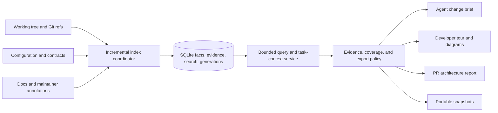

# CodeAtlas implementation roadmap: evidence for understanding and changing systems

Prepared from the [5 September 2026 audit](codeatlas-ai-era-audit-2026-09-05.md) of version 0.10.0 at `9517fc4`.

**Build three connected workflows: a change brief for an agent, a guided system tour for a developer, and an architecture report for a PR.** All three must consume the same evidence and freshness contracts. Repair the demonstrated semantic defects first.

This document proposes work. Items listed in the implementation-progress section are present in the working tree; other commands and schemas described as new are not implemented. Estimates are engineering effort, not delivery commitments. Assume one experienced full-time maintainer, existing TypeScript expertise, and access to voluntary design partners. AI assistance is useful but does not remove semantic review and evaluation costs. The full roadmap exceeds 90 days; the final section defines a narrower 90-day release.

## Implementation progress — 6 September 2026

The first P1 slice is implemented in the working tree:

- Regression fixtures cover return-expression order, exclusive branches, cleanup on return, unsupported ternaries, duplicate qualified names, evidence hashes, and MCP contracts.
- Symbol lookup now requires an exact stable ID when a qualified name has multiple candidates.
- IR `1.1` separates file and exact-range hashes, records excerpt status, uses 1-based lines with 0-based columns, validates CFG references, and loads stored `1.0` snapshots through an explicit in-memory compatibility upgrade.
- JavaScript, TypeScript, and Python CFG construction recursively lowers the supported branch, loop, try/catch/finally, return/raise, break/continue, and call constructs. Every graph declares its approximation kind, supported constructs, unsupported constructs, and truncation state.
- All 19 default canonical MCP tools advertise a common validated result envelope and accurate read-only/local annotations. Responses expose snapshot provenance, generations, freshness, content trust, and query coverage.

Validation at this checkpoint: `npm run check` passes 157 tests in 37 files, and `npm run package:smoke` passes against the packed consumer artifact. Remaining P1 work should concentrate on preserving all unresolved/conditional diagnostics through projections and giving recoverable MCP failures a typed error contract before P2 claims are gated.

## Product outcomes

| Workflow | User's question | Deliverable |
|---|---|---|
| Change brief | “Where should I implement this, and what could I break?” | Ranked entrypoints and edit candidates, dependency/flow slice, affected contracts, relevant tests, constraints, gaps, and source evidence within a chosen token budget |
| Guided KT | “Teach me this system and help me make my first change.” | Responsibility map, a small set of source-linked journeys, setup/test instructions, decisions, pitfalls, and a maintained reading order |
| PR architecture report | “What changed about the system?” | Before/after boundaries and flow paths, affected APIs/data/tests, new rule violations, uncertainty, and reviewer navigation |

Initial audience hypothesis: teams and maintainers using AI on unfamiliar TypeScript/Node repositories. Keep current Python support honest and regression-tested. Choose the next framework from real missed tasks; do not start by adding ten languages.

## Architecture to build toward



Keep SQLite, existing identifiers, adapters, invalidation, and rule evaluation. The canonical IR remains an interchange contract; it need not be fully loaded for every query. A source query can require structural freshness, dependency queries semantic freshness, and domain/rule queries architecture freshness. Every result records the generation it actually used.

Move coordinating logic out of CLI modules as it is touched. Queries should not write HTML, Markdown, or snapshots as a side effect of obtaining architecture context. A local viewer, CLI, MCP, and exporter should use the same projection and evidence semantics.

## P1 — Repair semantics and make evidence consistent

**Effort:** 2–4 engineer-weeks for a supported subset and the contract repairs below; broader language-complete CFGs require separate work. **Dependencies:** none. **Audit:** F1–F4.

Work:

- Add the audit's return-expression, if/else, finally, duplicate-name, and evidence-hash cases as regression fixtures before changing behavior.
- Fix unique symbol resolution independently of CFG work. Exact IDs remain stable; names produce candidates unless unique.
- Define hash scopes and source coordinate semantics. Give range evidence its own digest and declare whether an excerpt is complete, truncated, redacted, or unavailable.
- Replace source-order CFG chaining for the first supported JavaScript/TypeScript constructs with recursive lowering into basic blocks. Account for expressions before return, exclusive branches, joins, and abrupt exits. Avoid including nested function bodies in a parent's execution.
- Add `analysis_kind`, `supported_constructs`, `unsupported_constructs`, and truncation metadata. Unsupported exact analyses must not silently fall back to a diagram that appears exact.
- Preserve conditionality, resolution state, provenance category, and unresolved diagnostics through the IR boundary. Keep certainty of target resolution separate from certainty that a call executes.
- Introduce a common response envelope and validated schemas for canonical MCP tools; include content trust, query coverage, generation, and recoverable errors. Add accurate tool annotations.

Primary files: `src/analysis/control-flow.ts`, `src/ir/models.ts`, `src/ir/loader.ts`, `src/ir/evidence-validation.ts`, `src/mcp/ir-tools.ts`, `src/mcp/server.ts`, `src/mcp/schemas.ts`.

Acceptance:

- Reachable CFG paths match the specified outcomes for all newly supported fixtures, including cleanup on return.
- Duplicate names never choose a candidate silently; IDs continue resolving after supported renames.
- One valid statement citation is accepted consistently by answers, review, MCP, and exports. Changed bytes invalidate it.
- Default MCP responses pass advertised schema validation and distinguish conditional/dynamic/unresolved evidence.
- Old snapshots load through a documented compatibility path; test old readers/writers where compatibility is promised. Bump the schema when semantics change, not only when fields change.

## P2 — Establish outcome evaluations before optimizing claims

**Effort:** 1–2 engineer-weeks initially, then recurring maintenance. **Dependencies:** begin alongside P1; gate product claims after P1. **Audit:** F7.

Create `evals/` with pinned repository/commit manifests, task definitions, expected evidence, hidden patch tests where practical, and a runner. Store public, licensed fixtures and scrub provider transcripts before publication.

Start with approximately 30 tasks across 6 repositories as a development set; then build a separate held-out set with at least 30 tasks across 6 other repositories. Include architecture explanation, finding a change location, cross-file bug fixes, refactoring, affected tests, and deliberately unanswerable questions. Include unfamiliar naming and at least one negative/out-of-coverage repository.

Evaluate in layers:

| Layer | Measurement | Verifier |
|---|---|---|
| Extraction/resolution | Precision and recall by edge type and framework | Human-reviewed ground truth; explicitly count missing expected edges |
| Retrieval | Required-file/evidence recall at a token budget | Task-specific acceptable evidence sets, including alternative solutions |
| Explanation | Support, completeness, and calibrated abstention | Reviewer rubric against source; independent judgment for a sample |
| Code changes | Task success, regressions, unnecessary edits | Tests and review of the actual patch |
| Efficiency | Wall time, tool calls, model-visible input/output tokens, cost | Host/provider usage records plus tool timing |
| KT | Time to locate a change and correctly explain a flow | A defined exercise with developers new to the repository |

Compare the same agent with native file/search tools against that agent plus CodeAtlas. Later compare an appropriate repository-packing or graph-context alternative using equivalent setup effort and permissions. Pin exact model and harness versions and cache conditions. Use at least three repeats per task/model configuration initially; summarize paired differences and uncertainty at the task/repository level, not as if repeats were independent new tasks.

Retain existing release checks as smoke coverage. Rename `agentQuestion` to describe what it actually checks, and remove repository-specific answer special cases from general quality claims.

**Launch gate:** predeclare the primary outcome. A proposed target is at least 20% lower median context tokens or completion time with no material task-success regression, or a meaningful success-rate improvement at comparable cost. These are targets to validate, not current results. Report raw counts and confidence intervals; a small pilot cannot prove a narrow non-inferiority margin.

## P3 — Build a task-context compiler

**Effort:** 2–3 engineer-weeks for the first change-brief workflow. **Dependencies:** P1 contracts and P2 baseline; benefits from P4. **Audit:** F5, F7, F9.

Proposed user interface:

```text
codeatlas context "Add rate limiting to login" --budget 6000 --format markdown
codeatlas context --diff HEAD --budget 6000 --format json
```

Proposed MCP entrypoint: `get_change_context`. Retain detailed existing tools for follow-up; trial an optional small workflow profile rather than breaking all current integrations.

The planner should:

1. Classify task intent and resolve explicit symbols, files, endpoints, and domains.
2. Retrieve candidates through exact/path/FTS lookup and approved documentation vocabulary. Add optional semantic candidate retrieval only after measuring a recall gap.
3. Expand bounded verified and potential relationships separately; add associated tests, contracts, rules, and decisions.
4. Rank candidate change locations using task match and structural role. Label recommendations as inferences and explain their supporting paths.
5. Select a diverse evidence set, deduplicate overlapping ranges, and fit it into the budget. Preserve enough room for gaps, coverage, and follow-up instructions.
6. Return a brief that a person can read and an agent can consume without interpreting a full graph.

Proposed packet shape:

```ts
type ChangeContext = {
  schema_version: string;
  snapshot: { id: string; fingerprint: string; generations: Record<string, number> };
  task: string;
  summary: string;
  change_candidates: Candidate[];
  relevant_flows: FlowSlice[];
  affected_contracts: ContractRef[];
  relevant_tests: TestRef[];
  constraints: ConstraintRef[];
  evidence: EvidenceRef[];
  gaps: AnalysisGap[];
  budget: { requested: number; used: number; tokenizer: string; estimated: boolean };
  coverage: CoverageSummary;
  continuation: string | null;
  content_trust: "untrusted_repository_content";
};
```

`Candidate`, `EvidenceRef`, and related types must refer to the shared graph/IR contract. Do not create another independent inference pipeline. The host model can synthesize prose from the packet; optional local or hosted narration is a later explicit capability. Static facts must not require an LLM.

Primary files: new `src/context/` planner, ranker, budgeter, and packet modules; existing `src/storage/search.ts`, `src/analysis/impact.ts`, `src/mcp/relevance.ts`, `src/cli/index.ts`, `src/cli/setup.ts`, and `src/mcp/server.ts`.

Acceptance:

- A 6,000-token request stays within the selected tokenizer's budget, including its envelope; an estimate is labeled and conservative.
- Every important factual claim references valid evidence. Every recommendation remains distinct from a fact.
- An underspecified task returns useful candidates and a precise gap rather than guessing a target.
- Pilot tasks demonstrate required-evidence recall and task success against native search baselines.
- Setup verifies the installed server with a minimal query. Optional workflow instructions use mergeable, user-visible files and preserve existing instruction content.

## P4 — Query from indexes and load projections on demand

**Effort:** 3–5 engineer-weeks for the full service/viewer change; first search improvements can ship in 3–5 days. **Dependencies:** P1 envelope and generation contract. **Audit:** F5–F6.

First increment:

- Precompute `symbolById`, `evidenceById`, and adjacency maps per cached generation.
- Route canonical search candidate retrieval through existing FTS/path/name indexes and preserve the response schema.
- Stop recomputing full searchable evidence text for every symbol on each query.
- Instrument freshness, retrieval, projection, serialization, and transport separately.

Second increment:

- Add a query-store interface that reads bounded symbol/evidence/relationship projections from SQLite.
- Separate `ensureIndexed`, `queryProjection`, `compileSnapshot`, and `exportSnapshot`; a query must not regenerate unrelated artifacts.
- Implement on-demand CFGs for requested functions instead of silently limiting generation to the first 300 functions.
- Introduce an optional `codeatlas serve` with loopback binding, per-session access, origin checks, and bounded generation updates. Browser subscriptions follow committed generations.
- Extract the HTML script into testable viewer modules. Bundle mode loads a manifest and requested shards; implement an explicit offline-compatible loading mechanism instead of assuming unrestricted `fetch(file://...)` works.
- Keep single-file export and expose its estimated source/data size before generation. Reuse layouts and stable IDs to reduce visual movement between snapshots.

Primary files: `src/service/architecture-service.ts`, `src/service/freshness.ts`, `src/compiler/build.ts`, `src/storage/`, `src/mcp/ir-tools.ts`, `src/export/html.ts`, `src/export/json.ts`, and new viewer/query modules.

Proposed budgets, to calibrate on named hardware and corpus:

| Scenario | Initial target |
|---|---|
| Warm canonical search on the self-index | p95 below 300 ms, including freshness and serialization |
| Warm change brief on a representative medium TS repository | p95 below 1 second, excluding model synthesis |
| Initial live/bundle view | First useful diagram below 2 seconds with bounded initial data |
| Incremental query | Work proportional to the affected neighborhood; publish phase counts and timings |
| Graph growth | Record peak RSS, database size, artifact size, and interaction latency at 10k/100k symbols and 1M relationships |

A fixed time goal must not allow stale answers. If freshness misses its budget, return an explicit updating state or wait according to the caller's requirement. Test no-change, dirty edit, rename/delete, branch switch, worktree separation, failed refresh, and concurrent readers. Distinguish startup and warm performance.

## P5 — Turn the viewer into a knowledge-transfer product

**Effort:** 2–3 engineer-weeks for a thin guided-tour workflow. **Dependencies:** P1 evidence; reuse P3 context selection. Full live interaction depends on P4. **Audit:** F9.

Add a Start Here view, with this order:

1. What the system does and who uses it, citing README or an explicit maintainer description.
2. A small responsibility diagram with approximately 5–9 meaningful components; expand only on request.
3. Three important journeys: an ordinary request, a data write, and a failure/background path when supported.
4. Where to implement a representative change, which tests to inspect, and how to run them.
5. Decisions and constraints, citing ADRs/configuration or maintainer notes; unsupported rationale is explicitly unknown.

Introduce checked-in tour definitions, for example `.codeatlas/tours/*.yml` with explicit tracking guidance because `.codeatlas/` is currently ignored, or preferably a separate tracked `codeatlas-tours/` directory. Store reading order, stable entity references, annotations, ownership, and last-validated hashes. Invalidate individual steps when their supporting evidence changes; flag stale annotations for review.

Use the existing documentation-heading and intent indexing as discovery signals. Add bounded retrieval of cited document sections under the same content policy. A Git contributor count does not establish a responsible owner: ownership comes from CODEOWNERS or explicit annotations.

Improve the viewer with an adaptive details drawer, legible relation labels, fit-to-view, keyboard navigation, clear uncertainty/truncation, persistent deep links, and source-editor navigation. Share the same projections with exported SVG/Mermaid and agent context.

Primary files: `src/export/html.ts`, `src/export/markdown.ts`, `src/analysis/intent.ts`, `src/rules/domains.ts`, new `src/tours/`, and new viewer components.

**Acceptance:** recruit at least five developers unfamiliar with a sample repository; compare completion and explanation accuracy on defined tasks with and without a tour. Use different equivalent exercises or counterbalance order to reduce learning effects. No uncited design rationale is presented as a code fact.

## P6 — Add system and contract diagrams for one real stack

**Effort:** 3–5 engineer-weeks for the first useful stack slice. **Dependencies:** P1 evidence model, P2 evaluation fixtures; benefits from P5. **Audit:** F10.

This is a second-stage investment unless design partners demonstrate it is the primary adoption blocker.

- Add first-class `system`, `service`, `datastore`, `queue`, `external_system`, and `contract` entities, with source and deployment scope.
- Begin with package/workspace boundaries, Compose services, OpenAPI routes/contracts, and existing Prisma models. Add a frontend/API adapter, such as Next.js, only after selecting it from partner repositories.
- Match frontend consumers to API providers using declared contracts and resolvable paths. Keep ambiguous URLs, proxies, runtime routing, and generated clients as explicit candidates/gaps.
- Derive C4 context/container/component views from appropriate evidence. A folder does not automatically become a service, and configuration describes intended deployment rather than proof of current runtime state.
- Show a source-linked path such as UI action → API route → handler → database write, with unknown links visible.
- Make domain names and service boundaries overrideable, with provenance and reviewable configuration changes.

Primary files: `src/framework/registry.ts`, `src/framework/types.ts`, new contract/configuration adapters, `src/ir/models.ts`, `src/analysis/flows.ts`, and `src/export/mermaid.ts`.

**Acceptance:** manually reviewed fixtures from at least three independent applications in the selected stack; measure boundary and contract-link precision/recall. Unsupported deployment shapes must remain visible in coverage reports. Defer organization-wide cross-repository indexing and OpenTelemetry imports until one-repository system views deliver value.

## P7 — Package existing change analysis as a PR workflow

**Effort:** 1–2 engineer-weeks for a read-only report integration. **Dependencies:** P1; P8 before shareable exports. **Audit:** F7–F9.

Build on existing `diff`, `review`, snapshots, and rules. Add a reusable CI action/workflow and report renderer instead of a new analysis engine.

The first report should show:

- A concise summary of changed boundaries, routes, schemas, and important flow paths.
- A before/after diagram with stable component identity and explicit added/removed relationships.
- Definite and potential impact separately, including missing coverage.
- Relevant tests and suggested commands, labeled by evidence strength; static linkage is not runtime test coverage.
- Only new rule violations by default, with stable finding fingerprints, baselines, and reviewer suppression notes.
- Links into source and the bounded artifact for inspection.

Use CI job summaries and artifacts initially. Automated PR comments can be an optional later integration; deduplicate/update them and use minimal repository permissions. PR-head analysis must avoid executing arbitrary repository code. Provide a bundled-compiler/safe mode for untrusted PRs because current analysis can load the target repository's installed TypeScript compiler. Cache by revision, tool/adapter versions, config, and environment; use merge-base semantics and handle fork PRs explicitly.

Primary files: `src/cli/review.ts`, `src/review/`, `src/git/ref-atlas.ts`, `src/git/architecture-diff.ts`, new report renderers, and an action/consumer example separate from CodeAtlas's own CI.

**Acceptance:** deleted/renamed symbols and base/head changes are represented correctly; reports identify new versus existing issues; noisy findings can be inspected and explained. Measure maintainer-rated usefulness and false-positive rates on real PRs before introducing blocking checks beyond explicit architecture rules.

## P8 — Make export policy explicit before public sharing

**Effort:** 1–2 engineer-weeks for explicit policies and a narrow source-free export; broader detection/redaction follows. **Dependencies:** P1 evidence schema. **Audit:** F8.

Proposed interface:

```text
codeatlas build --export-policy internal
codeatlas build --export-policy shareable --preview
```

“Internal” can retain bounded source excerpts under existing local controls. “Shareable” starts without source text or diffs, applies configured path/metadata exclusions, and emits a manifest describing included classes of data. Neither mode silently uploads artifacts. Keep sensitive-data detection as defense in depth and document its limits.

Centralize policy before serialization so every exporter and MCP source response applies the chosen rules. Redaction retains evidence locations and original-content digests where appropriate, with redaction metadata; it must not be mistaken for a different source version. Include retention/pruning guidance for old source-rich artifacts.

Primary files: new `src/core/content-policy.ts`, `src/ir/evidence.ts`, `src/analysis/control-flow.ts`, `src/compiler/build.ts`, `src/export/`, and configuration schemas.

**Acceptance:** source-free exports contain no synthetic canary value from source excerpts, CFG labels, comments, diffs, or signatures. Preview enumerates exclusions and remaining structural metadata. Existing internal workflows continue working with explicit labeling.

## P9 — Make discovery and contribution easy

**Effort:** 1–2 engineer-weeks spread across delivery; ongoing community work. **Dependencies:** P2 results and P8 for public artifacts. **Audit:** F11.

- Rewrite the first screen of the README around the three workflows, one command, one screenshot, supported stacks, and a short demonstration. Move the long feature inventory into reference docs.
- Generate CLI/MCP reference documentation and a feature-by-language/framework coverage table from checked contracts and adapter fixtures. Label syntax support separately from verified resolution and framework semantics.
- Add a maintained public demo gallery built from pinned revisions. Each demo states tool version, coverage gaps, generation date, and how to reproduce it.
- Publish one concrete before/after story: a change task, native-agent baseline, CodeAtlas result, relevant architecture, passing tests, and measured overhead/savings.
- Offer an adapter starter example using the existing public registration API and an independently reviewed fixture requirement.
- Provide release notes grouped by corrected facts, improved workflows, and measured performance. Resolve the contradictory legacy and v2 roadmap descriptions.

Proposed growth measures are hypotheses, not current metrics:

| Measure | Initial learning target |
|---|---|
| Activation | At least 70% of a voluntary 20-user pilot reaches a useful map and grounded context query |
| Time to first value | Median below five minutes on the declared demo-sized repository |
| Return usage | At least half of activated pilot users use a change brief or review again the next week |
| Useful sharing | Track voluntary use of an artifact in a PR, onboarding session, or project documentation |
| Correctness feedback | Every confirmed incorrect edge becomes a regression fixture with a visible fix |

Preserve the no-telemetry default. Obtain these initial measures through opt-in local reports and partner interviews, not automatic source or prompt collection. Stars/downloads indicate attention; repeated task completion indicates utility.

## Focused 90-day delivery sequence

Allow roughly 10–11 productive engineering weeks plus time for user sessions, review, and contingency. Do not promise all full epics above in this window.

| Window | Commit to this slice | Exit condition |
|---|---|---|
| Weeks 1–2 | P1: reproduce defects; fix unique resolution and hash scopes; correct return/branch CFGs; label unsupported constructs; introduce default MCP envelope | Audit regressions pass; uncertainty and evidence survive canonical responses |
| Week 3 | P2: development evaluation set, native-agent baseline, first partner task sessions | A reproducible baseline and agreed primary outcome exist |
| Weeks 4–5 | P4 first increment: lookup maps, indexed canonical search, phase measurements; isolate query work from export where touched | Measured canonical query improvement with identical result correctness |
| Weeks 6–7 | P3: change brief, CLI/MCP entrypoint, token budgeting, setup smoke verification | Real tasks obtain relevant evidence within budget and support useful changes |
| Weeks 8–9 | P5 thin slice: source-linked tour and “copy this task context”; P8 source-free export | A developer can complete the first-change exercise; shareable output passes canary checks |
| Week 10 | P7 thin slice: existing review results rendered as CI summary and artifact | Several real PRs produce useful, low-noise reports |
| Weeks 11–13 | Held-out evaluations, fixes, documentation, demo, installation checks, performance/semantic gates | Publish only supported claims; decide the next investment from outcomes |

Explicitly deferred from this release: complete CFG language semantics, a full live/sharded viewer rewrite, multiple new system-contract adapters, organization-wide multi-repo analysis, runtime trace ingestion, a hosted SaaS, an autonomous patching agent, and a custom model/provider stack. The existing viewer can present the initial tour while the scalable viewer is developed separately.

If working with two experienced engineers, separate semantic/contracts and query/product work after establishing the shared evidence schema. Re-estimate at week 3 from evaluation failures; the full P4 and P6 work can become the next funded milestone.

## First reviewable pull requests

These are small implementation starting points, not a request to publish changes during the audit.

| PR | Scope | Main validation |
|---|---|---|
| 1 | Add semantic and evidence reproductions from the audit | Tests fail for the demonstrated reason on the current implementation |
| 2 | Fix ambiguous qualified-name resolution | MCP duplicate-name cases and stable-ID compatibility |
| 3 | Separate range/symbol/file evidence hashes | Consistent grounding across MCP, review, answers, and exports |
| 4 | Correct return and branch CFG lowering; label unsupported cases | Path reachability and branch exclusivity fixtures |
| 5 | Add canonical response schema, trust/freshness/coverage fields | Protocol contract snapshots for all 19 current tools |
| 6 | Add the outcome-evaluation runner and documented baseline | Reproducible pinned runs with explicit pass/fail outcomes |
| 7 | Replace repeated evidence scans and add indexed search | Result parity plus canonical latency/memory measurements |
| 8 | Introduce a budgeted change brief | Task-specific evidence recall and token-bound tests |
| 9 | Add a guided tour and source-free artifact policy | Developer exercise, browser navigation, and canary validation |
| 10 | Render PR architecture summaries and publish a reproducible demo | Base/head fixtures, package smoke, real maintainer feedback |

Run the repository's required check/package/release gates as applicable. Add browser interaction and screenshot checks for meaningful viewer flows; checking that generated HTML contains a label does not verify a diagram's semantics or usability.

## Investment decisions after the pilot

- If agents succeed but developers struggle to learn the system, invest next in P5/P6 tours and system contracts.
- If useful context arrives too slowly or memory dominates, complete P4 before adding adapters.
- If retrieval misses relevant files, compare documentation vocabulary and optional local semantic candidates; preserve graph validation of claimed relationships.
- If review is the recurring use case, improve changed-contract detection and CI integration before building a standalone knowledge portal.
- If measured agent outcomes do not improve, narrow the supported task/stack, inspect failures, and revise the interface before making broad launch claims.

The defensible asset is a tested, maintained corpus of architectural facts and useful task outcomes across changing repositories. The graph and diagrams are how users inspect that asset.
