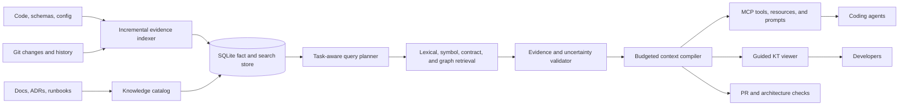

# CodeAtlas AI-readiness audit and implementation plan

Date: 2026-09-06
Scope: repository state after the earlier P1-P4 implementation passes and before the P0 remediation below

## Executive assessment

CodeAtlas has a credible technical wedge: it is a local evidence compiler for coding agents. Its stable graph IDs, provenance, explicit uncertainty, Git freshness, source ranges, bounded MCP responses, architecture rules, and deterministic analysis are stronger foundations than a generic repository chatbot or diagram generator.

The product is not ready to claim that it improves agent work or developer knowledge transfer. The checked-in evaluation suite defines the experiment but has no paired model results. More importantly, CodeAtlas failed two central dogfood questions on its own repository: the local answerer returned disconnected facts for an end-to-end MCP question, and a 3,000-unit change brief returned no change candidates. The system currently proves that it can extract a large graph; it does not yet prove that it selects the smallest correct context for a task.

The recommended product position is:

> CodeAtlas prepares the smallest evidence-complete change brief for a coding agent, then lets a developer inspect the same paths as a guided system map.

This is narrower and more defensible than “understands any codebase.” It connects an agent outcome to the existing graph and gives the viewer a concrete knowledge-transfer job.

## Audit evidence

The following measurements came from building and querying CodeAtlas against its own current working tree:

| Signal | Observed result |
|---|---:|
| Repository files | 257 |
| Build time | 32.48 s |
| Parsed / reused files | 211 / 46 |
| Reported symbols / actual symbols | 7,554 / 7,557 |
| Reported relationships / actual relationships | 28,527 / 31,639 |
| Evidence records | 59,655 |
| Resolution issues | 21,018 |
| Variable symbols | 5,632, or 74.5% of symbols |
| Canonical `atlas.json` | 121.6 MB on disk |
| SQLite database | 80.2 MB |
| Single-file HTML | 30.8 MB |
| Conservative single-file estimate | 185.8 MB |
| Eager control-flow graphs | 300 |

Largest canonical sections before pretty-printing were evidence at 36.0 MB, relationships at 21.0 MB, resolution issues at 16.3 MB, impact at 8.4 MB, and symbols at 5.9 MB.

The existing quality gate is healthy as a software project: type checking, lint, 166 tests across 39 files, 180 evaluation-fixture observations, and the packed-package smoke test pass. Those checks validate contracts and deterministic fixtures; they do not validate the usefulness of a real agent answer.

### Dogfood question: architecture explanation

Command:

```text
codeatlas ask "How does an MCP find_symbol request become an evidence-backed response?" . --json
```

The answer selected `serializeCanonicalResponse`, `CanonicalResponseContext`, and `responseContextFrom`. It omitted the actual route through `createCodeAtlasServer`, `findSymbolIr`, indexed candidate retrieval, projection ranking, pagination, evidence lookup, envelope construction, and `irResult`. Every returned fact had source evidence, but the answer did not answer the question.

### Dogfood question: change context

Command:

```text
codeatlas context "Add a new MCP query that explains how indexed retrieval becomes evidence-backed output" . --budget 3000 --format json
```

The packet returned no change candidates, no paths, no tests, and one unrelated ambiguity about a local variable named `candidate`. It used 2,829 of the requested 3,000 units. The budgeter prioritizes a gap before the first change candidate, and `estimatedContextTokens` currently counts UTF-8 bytes while the public field calls the unit tokens. This can spend the useful budget on global coverage and low-value uncertainty before supplying an edit location.

### Dogfood diagram

The generated Mermaid view contains 21 architecture regions and a dense set of aggregate edges. Folder-derived regions such as `Cli`, `Mcp`, `Storage`, and `Core` coexist with overlapping inferred regions such as `agent-interface`, `persistence`, `indexing`, `Src`, and `.`. The result is mechanically valid but not an effective system map. It does not show actors, deployable processes, storage, external boundaries, contracts, or a selected user journey.

## What is already strong

1. **Evidence is a first-class contract.** Symbols, relationships, uncertainty, and source ranges are explicit rather than hidden in prose.
2. **The system is local by default.** It needs no cloud account, vector database, or model API and treats repository content as untrusted.
3. **Freshness semantics are unusually careful.** HEAD, index, working tree, untracked files, generations, and fingerprints are represented.
4. **The graph supports change work.** Impact, Git changes, snapshots, rules, review findings, flows, and control flow share a canonical model.
5. **The MCP surface is read-only and bounded.** Stable IDs, pagination, byte limits, typed errors, and uncertainty metadata give hosts a predictable contract.
6. **The codebase is testable and packaged.** Multi-platform CI, release gates, fixture validation, and disposable package tests lower adoption risk.

These strengths should remain the product core. Semantic retrieval can suggest candidates, but compiler, graph, framework, and source evidence should continue to validate claims.

## Priority findings

### F1 — Critical: usefulness is unproven and current dogfood answers miss the task

The evaluation harness has a good paired design, but no complete native-versus-CodeAtlas agent run is checked in. The deterministic answer quality function measures grounding, primary scope, starting points, architecture specificity, and repetition; it does not measure whether the answer covers the requested causal path. A fully grounded irrelevant answer can therefore pass several checks.

Implement task-level expected concepts, files, relationships, and path coverage. Gate releases on paired agent outcomes and on a small self-dogfood suite that runs for every change to retrieval, ranking, context compilation, or graph semantics.

### F2 — Critical: the query path still materializes a huge canonical object

P4 added SQLite candidate queries and generation-cached maps, but `ArchitectureService` still reads and validates the complete `atlas.json` before creating the projection. On this small repository that means parsing more than 120 MB to answer the first canonical request. The query store bounds later SQL reads, but it does not yet remove the full-atlas startup cost or memory footprint.

Make SQLite plus a small generation manifest authoritative for interactive queries. Load symbols, relationships, evidence, impact paths, flows, and CFGs by bounded projection. Keep the full canonical export as an explicit export product rather than an MCP prerequisite.

### F3 — Critical: low-value records overwhelm task context

Variables form almost three quarters of symbols. Resolution issues reach 21,018 records, mostly unresolved references and multi-candidate references. Global counts are useful diagnostics, but task packets should not spend their first budget item on an unrelated resolution issue. The current context order places the first gap and relevant tests before the first change candidate.

Adopt a task evidence budget with reserved lanes: target and edit candidates first, then verified paths, tests and commands, constraints, relevant uncertainty, and optional background. Suppress local-variable ambiguity unless it touches a selected path or public contract.

### F4 — High: canonical statistics drift from canonical arrays

The build reports 7,554 symbols and 28,527 relationships, while the normalized export contains 7,557 and 31,639. Domain symbols and membership relationships are added after the initial loader statistics, and the final statistics refresh updates only flows, CFGs, violations, and findings.

Recompute every statistic after all enrichment and normalization. Validation should reject a document whose statistics disagree with its arrays.

### F5 — High: the architecture diagram is a dependency hairball

The default Mermaid diagram aggregates every cross-domain relationship and shows counts, but it gives all relationships nearly equal visual weight. A developer cannot distinguish a runtime call, data access, ownership, or a folder containment signal. The initial view also exceeds the number of concepts a new developer can scan comfortably.

Replace the single graph with progressive views: system context, runtime containers, domain components, one selected execution journey, data lineage, and contracts. Start with at most 8-12 nodes, collapse secondary regions, label edge semantics, and require evidence on every drill-down.

### F6 — High: inferred architecture regions need a canonical taxonomy

The self-map contains overlapping folder and inferred labels. That creates two competing answers to “what are the main systems?” and weakens both retrieval and human trust.

Separate `layer`, `domain`, `feature`, `package`, and `deployment unit` in the IR. Do not place them in one domain list. Prefer user-defined names, then evidence-backed framework/package names, then deterministic folder names, and finally inferred labels. Display confidence and naming evidence.

### F7 — High: the MCP product exposes only tools and exposes too many at once

The default server registers 20 canonical tools. That is navigable for a person reading a table, but agent hosts pay context and selection costs for tool definitions. Current MCP supports tools, resources, and prompts, while modern agent hosts increasingly load less-common tools on demand.

Keep four high-frequency tools always visible: search, prepare change context, trace/impact, and get evidence. Move stable read-oriented views into MCP resources and guided workflows into prompts. Preserve the existing tools behind compatibility or capability negotiation.

### F8 — High: CodeAtlas maps code but does not manage repository knowledge

Developer knowledge transfer needs purpose, ownership, invariants, operational behavior, decisions, and common change recipes. The current output is strongest on structure and weaker on why the structure exists. It indexes documentation and Git signals, but they do not form a maintained knowledge system with freshness, ownership, or contradiction checks.

Generate a short repository map for `AGENTS.md` or a linked CodeAtlas instruction file, plus a versioned knowledge index that points to architecture, design decisions, reliability, security, product behavior, and active plans. Report stale, missing, or contradictory knowledge rather than copying all prose into agent context.

### F9 — High: system and contract modeling is too narrow

HTTP endpoints and selected database models exist, but the canonical model lacks first-class external systems, processes, queues/events, jobs, configuration contracts, environment variables, deployment units, and schema compatibility. These are the boundaries agents most often break during cross-file changes.

Implement one deep stack slice first: Node/TypeScript services with Express or Fastify, Prisma, package workspaces, environment configuration, background jobs, and emitted/consumed events. Add Python equivalents after precision is demonstrated.

### F10 — Medium: exports need explicit confidentiality modes

The local trust model is strong, but HTML, JSON, snapshots, and agent packets may contain source excerpts. A user can accidentally commit or share a self-contained artifact containing proprietary code.

Add `private`, `source-free`, and `review` export policies. A source-free export should preserve hashes, file/line locations, graph structure, and statistics while removing excerpts and sensitive literals. Emit a manifest describing the applied policy and fail closed for unknown policy values.

### F11 — Medium: setup should demonstrate value before configuration

`codeatlas status` on an uninitialized repository returns only an error directing the user to `init`. Installation and MCP configuration are documented, but the shortest adoption loop is still multi-step and the first useful question is not guaranteed to work.

Make `codeatlas status` return a structured uninitialized state, and add `codeatlas demo` or `codeatlas onboard` that performs a bounded scan, presents three evidence-backed journeys, and prints a one-command MCP setup. Track local funnel timings without uploading telemetry.

### F12 — Medium: public proof and documentation lag implementation

The project was created recently and currently has no GitHub stars or forks. npm reports 260 downloads for the available period. The public GitHub README still presents the older beta workflow while the local working tree documents the 0.10.0 canonical surface. The local roadmap also lists the evaluation harness, task-context compiler, and indexed query work as “Next” even though they are implemented or in the current worktree.

Publish one coherent stable story after the outcome and privacy gates pass. Avoid marketing breadth. A reproducible before/after agent task, a two-minute architecture tour, and a transparent limitation report will be more credible than a long capability list.

## Target product architecture



The fact store should remain independent of the model. A model or optional local embedder may rewrite queries and retrieve candidates, but the validator decides which relationships can be claimed. The context compiler should be the shared product layer for MCP, CLI, viewer tours, and CI reports.

## Implementation plan

### P0 — Fix relevance, budgets, and canonical consistency

Effort: 1-2 weeks. Dependencies: none. Blocks every product claim.

Implementation:

1. Add self-dogfood tasks for architecture explanation, change planning, impact, affected tests, and unsupported questions.
2. Extend evaluation expectations with required concepts, required relationship types, allowed starting files, and forbidden distractors.
3. Replace term-only answer assembly with a query plan: classify intent, resolve anchors, expand typed paths, rerank complete paths, then render claims.
4. Reserve context budget for at least one edit candidate and its evidence before gaps or global coverage text.
5. Rename the current budget unit to `utf8_bytes_upper_bound`, or use a real tokenizer and report its exact identity.
6. Filter uncertainty by selected symbol, path, contract, or file. Keep global issue counts in diagnostics.
7. Recompute and validate canonical statistics at the end of every build.

Acceptance:

- The MCP dogfood answer contains the path `createCodeAtlasServer -> findSymbolIr -> QueryStore/projection -> irResult`, with source evidence for every hop.
- The change-context dogfood task returns `src/mcp/server.ts`, `src/mcp/ir-tools.ts`, `src/storage/query-store.ts`, and relevant tests before optional gaps.
- A 3,000-unit packet always contains a target or an explicit target-resolution failure; unrelated ambiguities cannot displace it.
- Statistics equal the normalized array counts in unit, integration, and self-build tests.
- A completed paired model run is checked in as structured observations; development fixtures remain clearly separate from publishable claims.

Implementation status on 2026-09-06: the engineering work in items 1-7 is implemented and covered by self-dogfood regression tests. A fresh self-build now validates exact canonical counters, the MCP question returns distinct retrieval and response paths, and a 3,000-byte context packet retains a source-backed target. The evaluation harness now rejects a claimed success when required concepts, relationship types, or starting files are missing, or when a forbidden distractor is present. A provider-backed paired model observation set is still required before publishing an outcome claim; this repository does not include a model runner or credentials, so no synthetic observations were recorded as model results.

### P1 — Make SQLite the interactive source of truth

Effort: 2-4 weeks. Dependencies: P0 contracts.

Implementation:

1. Replace full `atlas.json` loading in `ArchitectureService` with a small generation manifest and bounded query-store reads.
2. Store or derive typed projections for domains, flows, impact paths, rules, changes, and evidence without assembling the whole Atlas.
3. Fetch excerpts from synchronized source ranges on demand; persist range hashes and metadata rather than repeated text.
4. Compute full impact scores and CFGs lazily, caching them by generation and symbol.
5. Split full exports into independently compressed shards with a manifest; make bundle mode automatic above a configurable threshold.
6. Record cold startup, warm query, peak RSS, bytes read, rows read, serialization bytes, and cache hit state per request.

Acceptance on the current repository:

- First canonical MCP response does not read or parse `atlas.json`.
- Warm search and change-context p95 are below 250 ms on the documented test machine.
- First useful MCP response is below 3 seconds after process start.
- Peak MCP RSS is below 300 MB for the current repository.
- Default viewer payload is below 10 MB; full canonical export is created only when requested.
- Search result ordering remains identical for the declared parity corpus.

Implementation status on 2026-09-09: SQLite schema 11 persists the enriched canonical runtime as
typed, independently readable sections and an evidence-aware symbol FTS index. Canonical search
uses bounded SQLite reads and works when `atlas.json` is absent or invalid; explicit evidence reads
hydrate synchronized source ranges on demand. Generated control-flow graphs are cached by
generation, large viewers switch automatically to bounded HTML plus sharded full data, and MCP
responses report query, row, byte, timing, cache, and RSS telemetry. The benchmark harness retains
search-order parity and p50/p95 measurement gates; machine-specific results remain generated
evidence rather than hard-coded claims.

### P2 — Ship an agent-native MCP interface

Effort: 1-2 weeks. Dependencies: P0; benefits from P1.

Implementation:

1. Define four primary tools: `search`, `prepare_change`, `trace`, and `get_evidence`.
2. Expose stable resources such as `codeatlas://repository/overview`, `codeatlas://symbol/{id}`, `codeatlas://tour/{id}`, and `codeatlas://change/{fingerprint}`.
3. Expose prompts for repository onboarding, planning a change, reviewing a diff, and explaining a runtime journey.
4. Return concise resource links from tools so clients can progressively load details.
5. Add protocol-version capability tests and current cache metadata where supported.
6. Test installation and tool selection in Codex, Claude Code, GitHub Copilot CLI, Cursor, and one generic MCP inspector.

Acceptance:

- Always-loaded CodeAtlas tool definitions consume fewer than 2,000 model-visible tokens.
- Agents select the correct first CodeAtlas operation on at least 95% of the intent-routing fixture set.
- A host can complete onboarding and change planning using progressive resources without receiving the full graph.
- Legacy tool names remain available for one documented compatibility window.

Implementation status on 2026-09-09: the default MCP surface contains `search`, `prepare_change`,
`trace`, and `get_evidence`, with its serialized definitions held below the 2,000-token budget.
Repository, symbol, tour, and change resources support progressive reads; four reusable prompts cover
the declared workflows. Tool results link stable symbol resources, a routing corpus verifies the
first-operation policy including native fallback, and the former tools remain available through
`CODEATLAS_MCP_LEGACY_TOOLS=1` for the documented 0.x compatibility window.

### P3 — Turn the viewer into a guided KT product

Effort: 2-3 weeks. Dependencies: P0 and P1.

Implementation:

1. Replace the default hairball with a system-context page of at most 12 nodes.
2. Add lenses for runtime containers, domains, components, execution journeys, data lineage, contracts, changes, and uncertainty.
3. Add “Start here,” “How a request flows,” “How data is stored,” “How to add a feature,” and “How to test a change” tours.
4. Connect every diagram edge to its evidence, confidence, and unresolved alternatives.
5. Show why a domain has its name and allow a tracked configuration override.
6. Add shareable source-free exports and printable SVG/Markdown summaries.

Acceptance:

- The initial diagram has at most 12 nodes and no unlabeled edge.
- A developer can identify the CLI entrypoint, MCP entrypoint, storage boundary, query path, and export path for CodeAtlas in under five minutes.
- At least 80% of pilot users answer the prepared architecture questions correctly without opening raw source first.
- Every tour reports coverage gaps and the snapshot/fingerprint it represents.

Implementation status on 2026-09-09: the viewer now opens on a system context capped at 12 nodes
and presents five generated tours for onboarding, request flow, storage, feature work, and testing.
Runtime, data-lineage, contract, and change lenses expose bounded evidence locations; tour steps
carry relationship labels, confidence, fact class, gaps, snapshot, and fingerprint. Source-free
Markdown and print exports support sharing. The existing detailed SVG, domain, flow, impact,
change, rule, review, and evidence views remain available for drill-down. The 80% pilot-user target
still requires an external usability study and is not asserted by automated tests.

### P4 — Add system and contract intelligence for one complete stack

Effort: 3-5 weeks. Dependencies: P0; viewer benefits from P3.

Implementation:

1. Add first-class nodes for external actor, service/process, HTTP contract, event, queue/topic, job, datastore, environment variable, and configuration key.
2. Trace `route -> middleware/auth -> handler -> service -> query/update -> model/table` with branch and uncertainty semantics.
3. Trace event producers, registrations, consumers, retry/dead-letter behavior, and payload schemas when source evidence exists.
4. Import OpenAPI, AsyncAPI, Prisma, package manifests, and selected deployment/configuration formats as evidence-backed contracts.
5. Detect contract drift: declared-but-unimplemented, implemented-but-undocumented, incompatible schema change, and missing consumer evidence.

Acceptance:

- Precision and recall are measured independently for each supported contract edge type.
- Every shown external boundary has source or configuration evidence.
- Dynamic registration stays explicit and never becomes a verified runtime edge without sufficient evidence.
- One public Node/TypeScript repository demonstrates the complete flow with a pinned expected graph.

Implementation status on 2026-09-09: the graph now has first-class actor, service, process,
HTTP contract, contract schema/drift, event, topic, job, datastore, environment-variable, and
configuration-key nodes. OpenAPI 3/Swagger JSON and YAML operations link to Express, Fastify,
and FastAPI routes by method plus source-private route hash; request, response, security, and
runtime-implementation edges retain file/line evidence. AsyncAPI 2/3 JSON and basic YAML,
Prisma/SQLAlchemy, compose services, and selected Kubernetes resources are indexed as contract
or deployment evidence. The framework projection reports declared-but-unimplemented and
implemented-but-undocumented HTTP drift and refreshes those findings incrementally. A pinned
integration fixture independently asserts perfect precision and recall for its supported
`IMPLEMENTS_CONTRACT`, `ACCEPTS`, `RETURNS`, `PROTECTED_BY`, and `PUBLISHES` edges and verifies
that route, server, and channel literals do not enter SQLite. Incompatible schema evolution,
retry/dead-letter semantics, missing event consumers, and validation on independent public
repositories remain open P4 expansion work; no unsupported acceptance claim is made for them.

### P5 — Package change planning and review as the primary workflow

Effort: 2-3 weeks. Dependencies: P0-P2; benefits from P4.

Implementation:

1. Make `prepare_change` return edit locations, relevant contracts, invariants, affected tests, validation commands, verified paths, potential paths, and unresolved boundaries.
2. Add a read-only GitHub Action that comments with a compact architecture diff and links to source-free evidence artifacts.
3. Generate a machine-readable verification checklist that an agent can update as it runs tests.
4. Compare planned files, actual edits, regressions, and unnecessary edits in the evaluation harness.
5. Add snapshot-to-snapshot ownership, contract, and risk changes.

Acceptance:

- Median model-visible context falls by at least 20% against native tools with no more than a two-point task-success regression.
- Required-file recall is at least 90% on the held-out suite.
- Unsupported tasks trigger calibrated native-tool fallback rather than a confident empty plan.
- PR reports contain no source excerpts under the source-free policy.

Implementation status on 2026-09-09: change-context schema 1.2 adds explicit edit locations,
affected contracts, invariants, manifest-backed validation commands, and a pending/pass/fail/skip
verification checklist while retaining the caller's byte ceiling and explicit native-tool fallback
gaps. Snapshot comparison now reports ownership membership, contract, and review-risk deltas. The
evaluation harness records planned files, actual edits, named regressions, unnecessary edits,
planned-file precision/recall, plan/edit alignment, and unplanned files. `review-report` emits
graph facts and evidence locations without source diffs or excerpts; the included pull-request
workflow uploads both formats and updates one compact comment when write access is available.
Focused tests verify the source-free policy and default-budget retention. The 20% model-context,
two-point task-success, and 90% held-out recall targets still require a paired provider-backed run;
they are not inferred from deterministic fixtures.

### P6 — Build a living repository knowledge system

Effort: 2-3 weeks. Dependencies: P2 and P3.

Implementation:

1. Generate a short agent map that links to architecture, product, reliability, security, design decisions, active plans, and test commands.
2. Index ADR status, ownership, freshness, supersession, and contradictions against code/config facts.
3. Generate documentation coverage and freshness checks in CI.
4. Let teams pin canonical names, critical journeys, invariants, and owners in tracked configuration.
5. Keep generated facts separate from human-authored rationale and show both provenance types.

Acceptance:

- The root agent map stays below 150 lines and acts as a table of contents.
- Every critical system has an owner, purpose, entrypoint, principal contracts, and validation command or an explicit missing-knowledge finding.
- Stale documentation produces actionable file/line evidence and does not silently override code facts.

### P7 — Earn distribution after proof

Effort: ongoing, beginning after P0 and P5 evidence.

Implementation:

1. Publish to the official MCP Registry with verified repository and package metadata.
2. Provide one-command setup for major hosts plus repository-scoped examples.
3. Publish a two-minute demo centered on one difficult change, showing native search versus the CodeAtlas brief.
4. Publish reproducible accuracy, latency, memory, and privacy reports with pinned repositories and commits.
5. Create adapter contribution kits with fixtures, precision/recall gates, and a small starter issue backlog.
6. Maintain a public compatibility matrix and monthly dogfood report.

Acceptance:

- A new user reaches the first useful evidence-backed answer within three minutes.
- At least ten independent repositories pass the release-readiness workflow across supported operating systems.
- Public claims link to reproducible manifests and do not rely on generated capability counts alone.
- Adoption is tracked through opt-in or user-run local reports while source and prompts remain private by default.

## Delivery order

| Window | Deliverable | Release decision |
|---|---|---|
| Weeks 1-2 | P0 relevance, budget, statistics, and self-dogfood gates | Do not market agent improvement before this passes |
| Weeks 3-6 | P1 bounded SQLite query architecture | Make this the default MCP path |
| Weeks 5-7 | P2 compact MCP tools/resources/prompts | Validate across major hosts |
| Weeks 7-10 | P3 guided KT viewer and source-free sharing | Pilot with developers unfamiliar with the repository |
| Weeks 9-13 | P4 first complete system/contract slice | Publish precision/recall by edge type |
| Weeks 12-14 | P5 change/PR workflow and paired agent evaluation | Decide stable launch positioning |
| Following quarter | P6 living knowledge and P7 distribution | Expand languages only from measured demand |

P0 and P1 should receive most engineering attention. P3 produces the most visible demo, but building it on noisy retrieval and a 120 MB startup object would make the product attractive without making it dependable.

## Metrics that should govern the roadmap

### Agent outcome

- Task success and regression rate
- Required-file and required-symbol recall
- Correct path and contract coverage
- Unnecessary files read and edited
- Model-visible tokens, tool calls, wall time, and cost
- Calibrated abstention and native-tool fallback

### Developer knowledge transfer

- Time to identify the correct entrypoint and owning domain
- Time to explain one request/data journey
- Architecture-question correctness before and after the tour
- Confidence calibration when evidence is incomplete
- Time to first safe change and successful validation

### Retrieval and graph quality

- Precision/recall by relationship and contract type
- Context precision at 5/10/20 items
- Percentage of returned evidence used by the final answer
- Distractor and irrelevant-uncertainty rate
- Domain-name stability and manual override rate

### Performance and operability

- Cold build and incremental update p50/p95
- First MCP response and warm query p50/p95
- Peak RSS, database size, bytes read, and serialized response size
- Cache hit rate and generation reconciliation rate
- Install-to-first-answer time and setup failure rate

## Current market implications

Current agent platforms reinforce four choices in this plan:

1. Repository knowledge should be a short map into a maintained system of record, not one giant instruction file. OpenAI describes this as progressive disclosure for long-running agents.
2. Tool definitions consume context and reduce selection quality as integrations grow. GitHub Copilot CLI now supports loading less-common tools on demand.
3. Competitive code context combines keyword search, code graph navigation, and task-aware context selection. Sourcegraph documents this combined approach and supports context across repositories.
4. MCP is broader than tool calls. Resources and prompts are intended for stable context and reusable workflows, and the 2026 protocol adds explicit cache metadata while moving long-running tasks into an extension.

References:

- [OpenAI: Harness engineering in an agent-first world](https://openai.com/index/harness-engineering/)
- [OpenAI: Unrolling the Codex agent loop](https://openai.com/index/unrolling-the-codex-agent-loop/)
- [GitHub: Loading tools on demand with tool search](https://docs.github.com/en/copilot/concepts/agents/copilot-cli/tool-search)
- [GitHub: Repository and agent instructions](https://docs.github.com/en/copilot/how-tos/configure-custom-instructions-in-your-ide/add-repository-instructions-in-your-ide)
- [Sourcegraph: Cody context](https://sourcegraph.com/docs/cody/core-concepts/context)
- [Model Context Protocol: Core architecture](https://github.com/modelcontextprotocol/docs/blob/main/docs/concepts/architecture.mdx)
- [Model Context Protocol: 2026-07-28 specification update](https://blog.modelcontextprotocol.io/posts/2026-07-28/)
- [MCP Registry](https://github.com/modelcontextprotocol/registry)

## Decision

Do not compete as another universal code search tool or static diagram generator. Compete on evidence-complete change preparation and trustworthy knowledge transfer. Fix relevance and bounded query loading first, demonstrate a measurable agent outcome, and then use guided system journeys and contract maps as the product experience that developers can understand and share.
