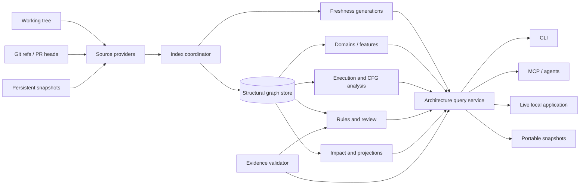

# CodeAtlas Product Implementation Plan

The strongest path is to evolve CodeAtlas from a batch artifact generator into a single, freshness-aware architecture engine with three delivery modes:

- A live local application for developers.
- A bounded, evidence-first MCP interface for agents.
- Portable static snapshots for sharing and offline inspection.

Every interface must query the same canonical data and produce the same architectural conclusions.

## Product principles

These should be treated as non-negotiable acceptance rules:

1. **Never knowingly return stale architecture.**
2. **Every important claim must include evidence or explicitly say evidence is insufficient.**
3. **Verified, inferred, heuristic, dynamic, and unresolved facts must remain distinguishable.**
4. **Large repositories must use bounded projections—not load the entire graph into a browser or agent context.**
5. **Developers and agents must receive the same underlying architecture facts.**
6. **Language-specific analysis must degrade honestly rather than pretending an approximate CFG is exact.**
7. **No source leaves the machine unless the user explicitly configures an external AI provider.**
8. **Every feature must have measurable correctness and performance targets.**

## Target architecture



The central addition is the **Architecture Query Service**. CLI commands, MCP tools, the live viewer, and static exports should stop independently loading or rebuilding the atlas.

## Delivery roadmap

| Milestone | Focus | Estimate |
|---|---|---:|
| 0 | Contracts, regressions, benchmarks | 1–2 weeks |
| 1 | Unified freshness and indexing service | 2–3 weeks |
| 2 | Scalable graph storage and viewer | 3–4 weeks |
| 3 | Domains, features, and architecture rules | 2–3 weeks |
| 4 | Execution flows and real CFGs | 3–5 weeks |
| 5 | Live impact, Git/PR analysis, snapshots | 3–4 weeks |
| 6 | MCP and evidence-linked answers | 2–3 weeks |
| 7 | Review mode and CI integration | 2–3 weeks |
| 8 | Hardening, evaluation, and 1.0 release | 2–4 weeks |

This is approximately **20–30 engineer-weeks**. A focused three-person team could deliver a strong production beta in roughly 10–14 calendar weeks. A solo implementation should expect 5–7 months, including evaluation and stabilization.

## Milestone 0 — Contracts and regression protection

Before expanding features, establish contracts so later refactors do not silently change results.

### Work

- Fix the snapshot comparison bug in `src/git/architecture-diff.ts`.
- Add explicit tests for:
  - Removed entrypoints.
  - Deleted symbols and their former dependents.
  - Renamed files and symbols.
  - Clean working tree after a previous dirty build.
  - Arbitrary base/head comparison.
  - Multiple execution branches.
  - CFG edge topology.
- Document precise semantics for:
  - Domain.
  - Feature.
  - Technical layer.
  - Entrypoint.
  - Execution flow.
  - Control-flow graph.
  - Definite versus potential impact.
- Version the canonical IR as a real compatibility contract.
- Create benchmark repositories at several scales:
  - 10,000 symbols.
  - 100,000 symbols.
  - 1,000,000 relationships.
  - Large monorepo with workspaces.
- Record baseline metrics:
  - Cold index time.
  - One-file incremental index time.
  - No-change freshness time.
  - MCP query latency.
  - HTML size.
  - Peak memory.
  - Snapshot size.

### Acceptance criteria

- Every known audit defect has a failing regression test before it is fixed.
- Canonical IR fields and compatibility rules are documented.
- Performance budgets run in CI, with a separate scheduled large benchmark.
- The existing 98 tests continue to pass.

## Milestone 1 — Unified freshness and automatic indexing

This milestone removes the current split where some commands read stale IR while canonical MCP handlers rebuild on every request.

### Architecture service

Introduce a service similar to:

```ts
interface ArchitectureService {
  ensureFresh(requirement: FreshnessRequirement): Promise<ArchitectureContext>;
  getOverview(options?: ProjectionOptions): Promise<RepositoryOverview>;
  findSymbols(query: SymbolQuery): Promise<Page<SymbolSummary>>;
  getSymbol(id: string): Promise<SymbolDetail>;
  analyzeImpact(target: string, options: ImpactOptions): Promise<ImpactResult>;
  getFlow(id: string): Promise<ExecutionFlow>;
  getControlFlow(id: string): Promise<ControlFlowGraph>;
  compareGitRefs(base: string, head: string): Promise<ChangeAnalysis>;
}
```

### Work

- Create one process-wide index coordinator per repository.
- Deduplicate concurrent indexing and build requests.
- Cache the canonical architecture context by:
  - Repository identity.
  - Structural generation.
  - Semantic generation.
  - Architecture generation.
  - Working-tree fingerprint.
- Migrate the following to the service:
  - `ask`
  - `search`
  - `symbol`
  - `impact`
  - `diff`
  - `review`
  - All canonical MCP handlers.
- Preserve requirement-specific freshness:
  - Source queries need structural freshness.
  - Call graph queries need semantic freshness.
  - Domain and rule queries need architecture freshness.
- Add filesystem watching as a latency optimization.
- Continue authoritative Git/fingerprint reconciliation before returning results.
- Add `codeatlas serve` as the live application command.
- Keep `codeatlas build` as the portable static-export command.
- Add clear UI and MCP freshness metadata:
  - Current.
  - Updating.
  - Stale but available.
  - Failed to update.
- Reject stale evidence after failed synchronization.

### Concurrency behavior

- One writer per repository.
- Readers use the last complete generation.
- Never expose partially written graph state.
- Cancel or supersede obsolete queued refreshes.
- Coalesce rapid file changes into a short debounce window.
- Allow queries against the previous generation only when explicitly marked stale and the caller permits it.

### Acceptance criteria

- A source edit followed immediately by a CLI or MCP query returns the updated architecture.
- Ten concurrent MCP requests trigger at most one refresh.
- A no-change query does not rebuild the full canonical atlas.
- A failed update never changes the last-successful generation.
- Live updates work without requiring a manual `build`.

## Milestone 2 — Scalable graph storage and multi-level viewer

The current full-atlas HTML approach must be replaced before calling large-repository support complete.

### Delivery modes

#### Live mode

`codeatlas serve` provides:

- Localhost-only HTTP application.
- Random session token.
- Query API backed by `ArchitectureService`.
- Server-sent events or WebSocket updates.
- Incremental graph patches.
- Source navigation.
- Full search and filtering.

#### Portable bundle

`codeatlas build --bundle` provides:

- Small application shell.
- Manifest.
- Bounded initial projection.
- Sharded symbols, relationships, evidence, and flows.
- Local script-based chunks or another browser-compatible offline loading mechanism.
- No external CDN dependency.

#### Single-file summary

`codeatlas build --single-file` should contain:

- Repository summary.
- Domains and features.
- Entrypoints.
- Top risks.
- Changed architecture.
- Bounded symbol neighborhoods.
- No full embedded 60 MB atlas.

It should clearly direct users to bundle or live mode for complete exploration.

### Multi-level model

Implement this hierarchy:

```text
Repository
└── Workspace / package
    └── Domain
        ├── Feature
        │   └── Entrypoint / execution flow
        └── Module / directory
            └── File / class
                └── Function / method
                    └── Control-flow graph
```

Domains and features may overlap in presentation, but their semantics should differ:

- **Domain:** ownership or architectural boundary.
- **Feature:** user-facing capability spanning files and potentially domains.
- **Layer:** technical responsibility such as controller, service, repository, or model.

### Rendering work

- Wire `buildDefaultProjection()` into production rendering.
- Materialize domain, feature, module, and symbol projections.
- Add stable deterministic layout seeds.
- Use a Web Worker for layout and graph filtering.
- Virtualize long file, symbol, and finding lists.
- Build indexed maps once; remove repeated `atlas.relationships.filter(...)` scans.
- Support:
  - Expand/collapse.
  - Edge-type filters.
  - Confidence filters.
  - Domain isolation.
  - Impact overlays.
  - Git-change overlays.
  - Search that reveals hidden nodes.
  - Breadcrumb navigation.
- Show summarized edges such as “47 calls” or “18 cross-domain dependencies.”
- Load evidence only after selection.
- Remember view state in local storage.

### Performance targets

- Initial viewer shell under 1 MB.
- Initial meaningful projection rendered in under 2 seconds on the benchmark repository.
- Interaction p95 under 100 ms after data is loaded.
- No UI operation should scan the complete relationship array.
- Browser memory should remain bounded by the active projection.
- Static output size should grow by shards, not by duplicating the complete atlas inside HTML.

## Milestone 3 — Domains, features, and architecture rules

### Domain and feature detection

Retain current directory and dependency signals, then strengthen them with:

- Package/workspace boundaries.
- Import communities.
- Routes and handlers.
- Database models and tables.
- Test-to-production relationships.
- Symbol vocabulary.
- Documentation headings and ADRs.
- Configuration ownership.
- Git co-change history.
- User overrides.

### Data model

Add first-class IR collections:

```ts
interface AtlasFeature {
  id: string;
  name: string;
  memberIds: string[];
  entrypointIds: string[];
  domainIds: string[];
  evidenceIds: string[];
  confidence: number;
  provenance: AtlasProvenance;
}
```

Membership should carry evidence and confidence instead of existing only as arrays.

### Configuration

Replace the custom YAML subset with a standards-compliant parser and schema validation.

Support:

```yaml
domains:
  authentication:
    include:
      - src/auth/**
    exclude:
      - src/auth/generated/**

features:
  password-reset:
    routes:
      - POST /password/reset
    include:
      - src/auth/reset/**

architecture:
  rules:
    - id: controllers-do-not-call-database
      severity: error
      source:
        layer: controller
      forbid:
        path_to:
          layer: repository
      unless_via:
        layer: service
```

### Rule capabilities

Implement and test:

- Direct dependency restrictions.
- Transitive path restrictions.
- Allowed dependency declarations.
- Cross-domain restrictions.
- Layer ordering.
- Naming and file-location rules.
- Entrypoint exposure rules.
- Cycle restrictions.
- Maximum fan-out and dependency-depth rules.
- Public API boundaries.
- Exceptions with reason and expiry.
- Rule baselines for existing violations.
- “Only report newly introduced violations” mode.

### Outputs

- Human-readable CLI.
- JSON.
- SARIF.
- HTML overlays.
- MCP responses with violating paths and evidence.

### Acceptance criteria

- Rules identify direct and transitive violations deterministically.
- Every violation includes the exact relationship path.
- Configuration errors include file, line, and actionable messages.
- Existing baseline violations do not block unrelated PRs.
- Features are visible in HTML, CLI, IR, snapshots, and MCP.

## Milestone 4 — Path-faithful execution and control flow

### Real control-flow graphs

Replace the current interesting-node sequence with language-specific CFG builders.

Start with TypeScript/JavaScript and Python.

Each CFG should contain:

- Basic blocks.
- Statement ranges.
- Entry and exit blocks.
- True/false branch edges.
- Loop body, exit, and back edges.
- Return and raise termination.
- Try, catch, finally, and exception edges.
- Break and continue.
- Await/yield boundaries where supported.
- Unreachable blocks.
- Truncation metadata.

Do not require SSA initially. Accurate basic-block topology is the priority.

### Language adapter interface

```ts
interface ControlFlowAdapter {
  languages: string[];
  buildFunctionCfg(input: FunctionSource): ControlFlowGraph;
  confidence: "verified" | "approximate";
  limitations: string[];
}
```

Unsupported constructs must be labeled approximate rather than silently flattened.

### Execution-flow model

Replace one flattened sequence with a graph:

```ts
interface ExecutionFlow {
  id: string;
  entrypointId: string;
  nodes: FlowNode[];
  edges: FlowEdge[];
  paths: FlowPathSummary[];
  asyncBoundaries: AsyncBoundary[];
  truncated: boolean;
}
```

Represent:

- Branches and joins.
- Calls and returns.
- Events and message publication.
- Queue or job execution.
- Database reads and writes.
- External service calls.
- Middleware.
- Framework dispatch.
- Async continuation.
- Recursion and bounded cycles.

### Sequence projection

The sequence diagram should be a projection of the execution graph, with:

- Participants grouped by domain or component.
- Calls ordered only when order is supported by evidence.
- Alternative branches.
- Loop markers.
- Async messages.
- Confidence and evidence on every step.
- A warning when static analysis cannot determine runtime order.

### Testing

Create golden fixtures for:

- Nested conditions.
- Early returns.
- Loops with break/continue.
- Try/catch/finally.
- Async calls.
- Middleware chains.
- Recursive calls.
- Multiple implementations.
- Dynamic or unresolved calls.

### Acceptance criteria

- CFG edges match hand-authored golden fixtures.
- Sequence diagrams never present breadth-first traversal order as runtime order.
- Unsupported dynamic behavior is visible as unresolved or potential.
- Clicking an edge opens the supporting source range.

## Milestone 5 — Live impact, Git/PR analysis, and snapshots

### Live impact engine

Separate impact into explicit categories:

- Direct dependent.
- Transitive dependent.
- Public API impact.
- Entrypoint impact.
- Domain impact.
- Data-model impact.
- Test impact.
- Configuration impact.
- Potential dynamic impact.

Each result should contain:

- Changed symbol.
- Impacted symbol.
- Relationship path.
- Confidence.
- Evidence.
- Reason for risk score.
- Whether the path existed before the change.
- Whether the change introduced or removed the risk.

Use incremental invalidation so only affected impact summaries are recomputed.

### Git source abstraction

Introduce:

```ts
interface SourceRevision {
  id: string;
  readFile(path: string): Promise<string>;
  listFiles(): Promise<string[]>;
  gitMetadata(): Promise<RevisionMetadata>;
}
```

Support:

- Working tree.
- Index/staged tree.
- Commit ref.
- Merge base.
- Cached architecture snapshot.

This removes the requirement that the requested head be checked out.

### PR-aware analysis

Core PR analysis should remain provider-independent:

- Resolve merge base.
- Build or load base architecture.
- Build or load head architecture.
- Compare symbols, relationships, domains, features, entrypoints, rules, and impact.
- Recover deleted symbols from the base graph.
- Map hunks against both base and head locations.
- Preserve rename identity.
- Distinguish:
  - Existing risk.
  - Introduced risk.
  - Removed risk.
  - Modified risk.

Optional adapters can add:

- GitHub PR metadata.
- GitLab merge requests.
- Local branch comparison.
- CI annotations.

### Live UI

When a file changes:

1. Show “updating architecture.”
2. Reindex affected files.
3. Patch the current projection.
4. Highlight added, modified, moved, deleted, and impacted nodes.
5. Update impact paths and findings.
6. Preserve the developer’s current selection.
7. Show the generation/fingerprint used.

### Snapshot redesign

Add a SQLite snapshot catalog:

- Snapshot ID.
- Commit.
- Branch.
- Fingerprint.
- Timestamp.
- Label.
- Pinned status.
- Schema version.
- Parent snapshot.
- Compressed size.
- Content checksums.

Store compressed or delta-oriented snapshots where practical.

Commands:

```text
codeatlas snapshot create --label before-refactor
codeatlas snapshot list
codeatlas snapshot show <id>
codeatlas snapshot compare <old> <new>
codeatlas snapshot pin <id>
codeatlas snapshot delete <id>
codeatlas snapshot gc
```

### Acceptance criteria

- Arbitrary local refs can be compared without checkout.
- Deleted symbols retain base-side evidence and impact.
- The live viewer updates after a source edit without manual reload.
- Snapshot comparison correctly handles additions, removals, moves, and entrypoints.
- Snapshot retention cannot remove pinned snapshots.
- Interrupted snapshot writes leave no visible partial snapshot.

## Milestone 6 — MCP and evidence-linked answers

### MCP architecture

Keep compatibility with existing tools, but expose a smaller recommended core to agents:

- `codeatlas_status`
- `codeatlas_overview`
- `codeatlas_search`
- `codeatlas_get_symbol`
- `codeatlas_get_domain`
- `codeatlas_trace`
- `codeatlas_impact`
- `codeatlas_changes`
- `codeatlas_review`
- `codeatlas_source`
- `codeatlas_rules`
- `codeatlas_snapshot_diff`

Existing aliases can remain through a deprecation period.

### MCP requirements

Every tool should have:

- Strict input schema.
- Strict output schema.
- Pagination.
- Response-size budget.
- Freshness generation.
- Evidence references.
- Confidence.
- Explicit uncertainty.
- Stable IDs.
- Continuation cursor.
- Clear typed errors.

Avoid rebuilding artifacts per tool call. All tools should use `ArchitectureService`.

Add MCP resources for large data:

```text
codeatlas://symbol/<id>
codeatlas://evidence/<id>
codeatlas://flow/<id>
codeatlas://snapshot/<id>
```

### Agent-oriented context assembly

Add a tool that prepares bounded context for a specific task:

```text
codeatlas_context_for_change
```

Inputs:

- Target symbols or files.
- Intended change.
- Maximum token budget.
- Include tests.
- Include rules.
- Include callers/callees.
- Include Git changes.

Output:

- Relevant symbols.
- Dependency paths.
- Rules.
- Tests.
- Evidence excerpts.
- Known uncertainties.
- Suggested files to inspect next.

### Evidence-linked answer pipeline

Use a provider-independent pipeline:

1. Parse the question.
2. Retrieve graph candidates.
3. Build candidate paths.
4. Resolve source evidence.
5. Optionally ask an LLM to synthesize.
6. Parse proposed claims.
7. Reject claims without valid evidence.
8. Return answer, claims, citations, uncertainty, and freshness.

The LLM must never manufacture evidence IDs.

### AI modes

- `off`: deterministic graph responses only.
- `local`: configured local model.
- `remote`: explicitly configured provider.
- `agent`: return structured evidence and let the MCP-connected agent synthesize.

Default should remain `off` or `agent`.

### Security

- Treat repository text as untrusted.
- Mark source excerpts as data, not instructions.
- Redact configured secret paths.
- Limit excerpt length.
- Do not transmit source externally without consent.
- Log which files were sent to a configured model.
- Provide `--explain-context` to preview outgoing context.

### Acceptance criteria

- No MCP response is stale.
- Every deterministic relationship claim has valid evidence.
- Agent responses remain bounded at configured token limits.
- Invalid or hallucinated evidence IDs are rejected.
- New canonical tools are exercised through real MCP transport tests.

## Milestone 7 — Evidence-gated code review

### Review pipeline

Use deterministic analysis first:

1. Resolve base and head.
2. Map hunks to base/head symbols.
3. Detect changed public contracts.
4. Calculate new and removed relationships.
5. Evaluate architecture rules.
6. Calculate newly introduced impact.
7. Find affected tests.
8. Detect domain/feature boundary changes.
9. Build candidate findings.
10. Validate every candidate against evidence.
11. Optionally use AI for wording or cross-signal synthesis.
12. Deduplicate and rank.

### Finding categories

- Architecture-rule violation.
- Public API behavior change.
- New cross-domain dependency.
- New cycle.
- High-impact symbol change.
- Missing or disconnected tests.
- Data-model migration risk.
- Entrypoint behavior change.
- Removed error handling.
- Unresolved dynamic dependency.
- Significant architecture drift.

### False-positive controls

- Only comment on changed lines where possible.
- Separate “blocking,” “warning,” and “informational.”
- Require deterministic evidence for blocking findings.
- Require at least two supporting signals for heuristic findings.
- Do not repeat baseline violations.
- Allow repository-specific suppression with reason and expiry.
- Track finding acceptance/dismissal for evaluation without silently retraining.

### Outputs

- Terminal summary.
- JSON.
- Markdown.
- SARIF.
- GitHub Checks annotations.
- Optional PR comments.
- HTML review overlay.

### Acceptance criteria

- Every blocking finding points to a changed line and an evidence-backed architectural path.
- Existing unchanged violations do not appear as new findings.
- Review findings remain deterministic when AI is disabled.
- AI-disabled and AI-enabled modes use the same underlying facts.
- False-positive rate is measured against a labeled PR corpus.

## Milestone 8 — Hardening and 1.0 readiness

### Evaluation corpus

Maintain a permanent corpus containing:

- Small TypeScript service.
- React frontend.
- Express/Fastify backend.
- Python/FastAPI service.
- Monorepo.
- Repository with generated files.
- Repository with ambiguous imports.
- Repository with dynamic dispatch.
- Repository with large dependency graph.
- Real open-source repositories with pinned commits.

### Quality metrics

Recommended targets:

| Metric | Target |
|---|---:|
| Stale MCP responses | 0 |
| Deterministic claims with valid evidence | 100% |
| Verified relationship precision | ≥95% |
| One-file incremental refresh, medium repo | p95 under 2 seconds |
| No-change MCP freshness and query | p95 under 500 ms |
| Initial live viewer projection | under 2 seconds |
| Browser interaction after load | p95 under 100 ms |
| Architecture diff determinism | 100% |
| Package smoke success on supported platforms | 100% |

Recall should be reported separately by language and relationship type. CodeAtlas should never hide low recall behind a single aggregate score.

### CI gates

Every release should require:

- Type checking.
- Unit tests.
- Parser golden tests.
- Incremental-index tests.
- Architecture diff tests.
- CFG/flow golden tests.
- CLI end-to-end tests.
- MCP transport tests.
- Browser interaction tests.
- Package smoke tests.
- Snapshot compatibility tests.
- Performance budget checks.
- Security/path traversal tests.
- Windows, macOS, and Linux validation.

### Language expansion

After TypeScript/JavaScript and Python are solid, use the adapter interfaces to add:

1. Go.
2. Java/Kotlin.
3. Rust.
4. C#.
5. C/C++ where demand justifies the complexity.

Language support should be advertised per capability—for example, “structural graph supported, semantic calls partial, CFG unavailable”—instead of one generic supported-language label.

## Feature-to-milestone mapping

| Requested feature | Primary milestone |
|---|---:|
| Multi-level architecture views | 2 |
| Live change-impact analysis | 1 and 5 |
| Git diff / PR-aware visualization | 5 |
| Automatic project indexing | 1 |
| Execution / sequence diagrams | 4 |
| Function control-flow visualization | 4 |
| Architecture-aware domains/features | 3 |
| Architecture rules | 3 |
| MCP / agent tool interface | 6 |
| Evidence-linked AI answers | 6 |
| Code review mode | 7 |
| Large-repo graph simplification | 2 |
| Persistent architecture snapshots | 5 |

## Recommended first implementation sprint

The first sprint should be narrowly focused on foundations:

1. Fix snapshot entrypoint removal and add regression tests.
2. Add freshness tests proving v2 CLI queries cannot read stale IR.
3. Introduce the `ArchitectureService` interface.
4. Migrate `ask`, `search`, `symbol`, and `impact` to that service.
5. Migrate canonical MCP handlers away from per-request `buildRepository()`.
6. Add artifact-size reporting and a CI size budget.
7. Wire `buildDefaultProjection()` into the HTML exporter.
8. Add a clean-build test asserting the viewer does not embed the entire atlas for large fixtures.
9. Document the three modes: live, bundle, and single-file summary.
10. Commit each concern separately so every commit remains buildable and testable.

The most important strategic choice is to complete the shared architecture service and scalable data plane before adding more UI screens. Once freshness, scale, and evidence contracts are reliable, the remaining features can be built without duplicating analysis or creating conflicting results across CLI, HTML, and MCP.
